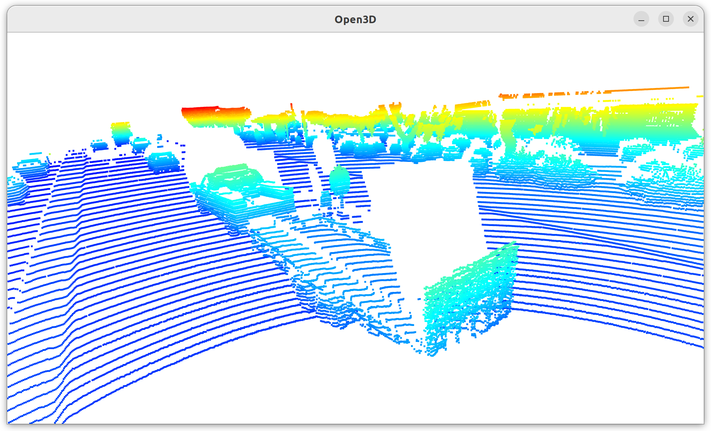
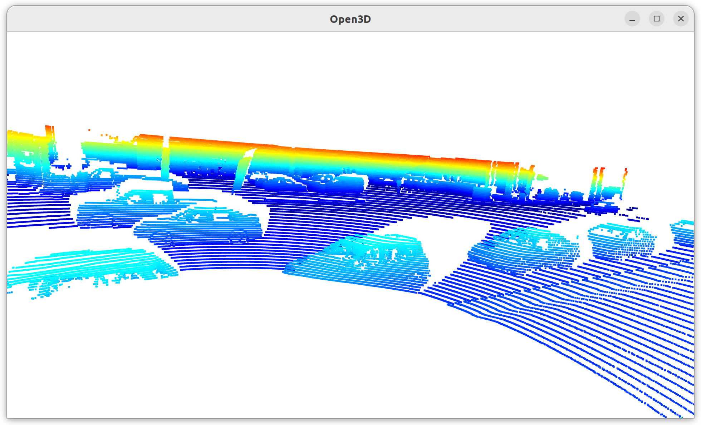
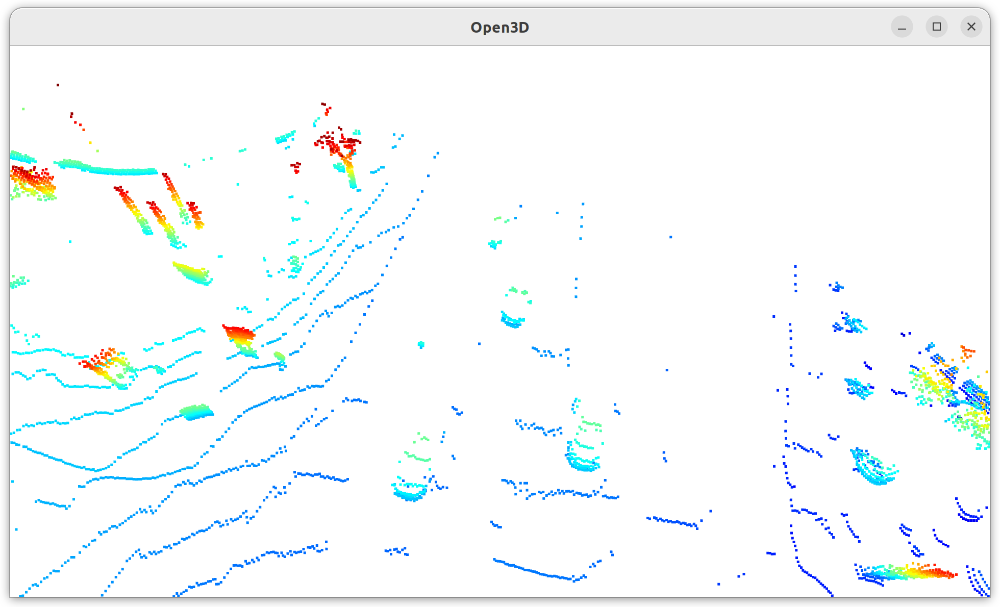
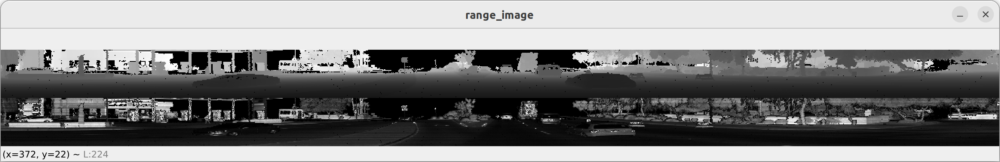

# Mid-Term Project: 3D Object Detection Write Up

### Find and display 10 examples of vehicles with varying degrees of visibility in the point-cloud

This shows a trailer in front the Waymo car clearly. (1 vehicle)

For the two vehicles on the left, the bottom is not visible because of the blind spot. In contract, the entire shapes of two vehicles on the left further from the Waymo car are clearly visible, and also two vehicles on the right are clearly visible too. (6 vehicles)

These 5 vehicles are in front of the Waymo car but since they are far away, LiDAR detections are sparse and the entire shape is not clearly shown. (5 vehicles)

### Identify vehicle features that appear as a stable feature on most vehicles (e.g. rear-bumper, tail-lights) and describe them briefly. Also, use the range image viewer from the last example to underpin your findings using the lidar intensity channel.

The rear bumper is generally a reliable feature for detecting cars. They tend to be the sole visible feature as vehicles get further.

You can confirm that observation in the intensity channel of a range image:

The rear window is another feature that is relatively clearly visible in the range image.